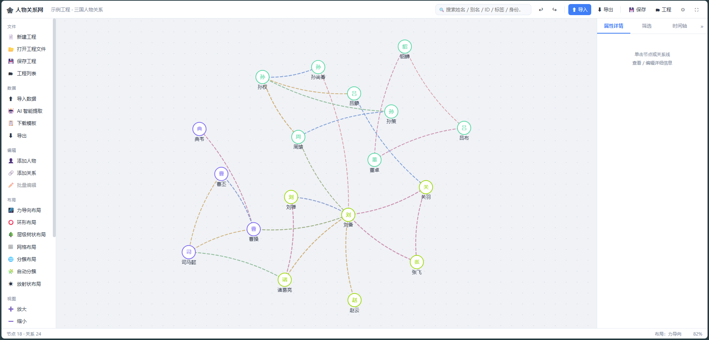
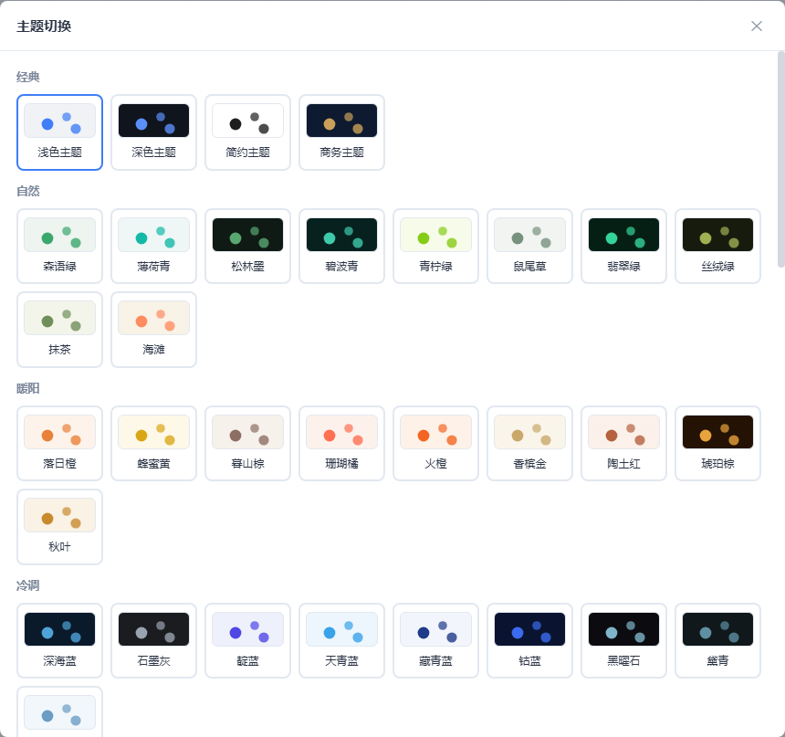
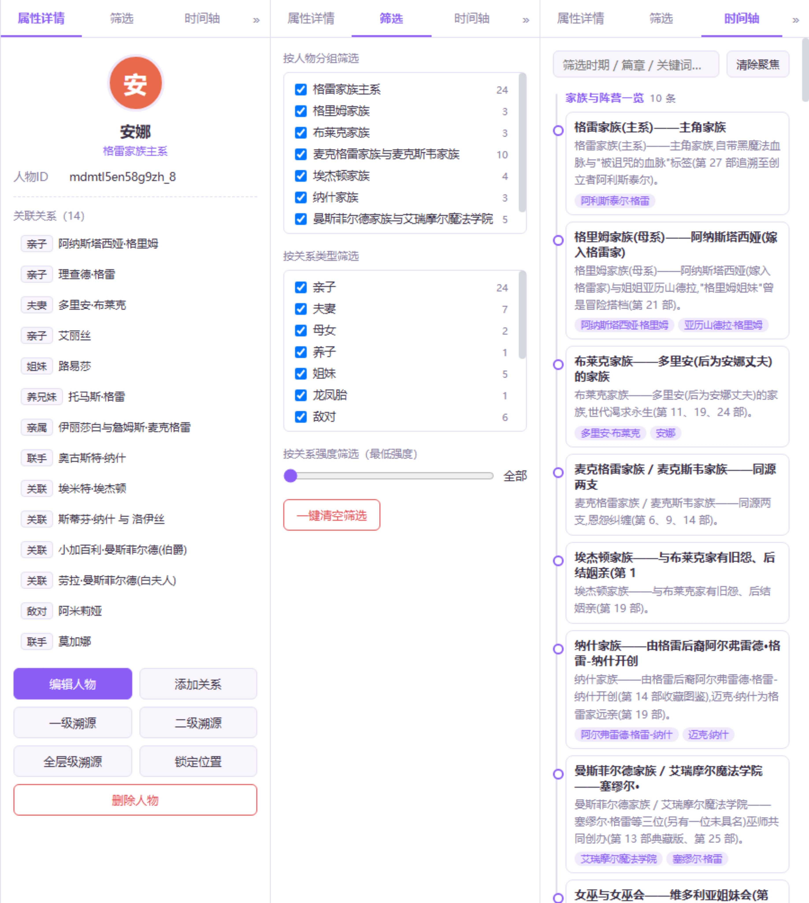
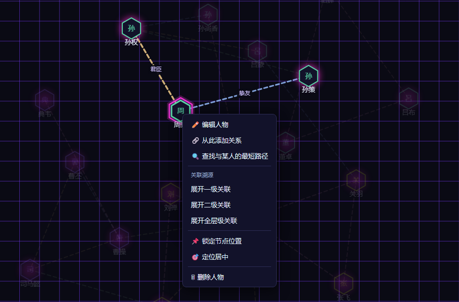

# 人物关系网可视化工具

一款轻量化、高可视化、易操作的**动态人物关系网生成工具**，核心主打「批量导入、自动生成、动态交互、自由编辑」。
依据《人物关系网软件需求规格说明书（PRD）》开发，覆盖全部 P0 核心功能与 P1 体验功能。



## 🚀 快速开始

**无需安装任何环境**：直接双击 `index.html` 即可在浏览器（推荐 Chrome / Edge）中离线运行。

也可以通过本地服务器运行（可选）：

```bash
# 在本目录下执行任一命令，然后访问 http://127.0.0.1:8642
python _serve.py
# 或
python -m http.server 8642
```

> 首次打开会有新手引导；点击「加载示例数据体验」可立即查看三国人物关系演示。

## ✨ 核心亮点

- **一键导入**：Excel / CSV / JSON / Markdown 剧情文档多文件批量导入，自动识别表头、校验去重、容错解析（错误逐行提示、可导出错误日志）


- **自动成网**：导入后自动布局并适配画布，3 秒完成从表格/文档到动态关系网的转换
- **7 种自动布局**：力导向（默认）/ 环形 / 层级树状 / 网格 / **分簇**（按分组聚簇）/ **自动分簇**（Louvain 社区发现自动识别圈子，无需手填分组）/ **放射状**（核心人物为中心）
- **动态画布**：拖拽、缩放、搜索定位、批量框选、右键菜单、撤销重做；**单击人物常驻显示其关联**（再点/ESC 恢复）
- **界面语言切换（中/英）**：系统设置 → 界面语言，全界面（侧栏/弹窗/提示/主题名）一键切换
- **80 套主题（16 类）**：经典：浅色 / 深色 / 简约 / 商务；自然：森语绿 / 薄荷青 / 鼠尾草 / 青柠绿 / 松林墨 / 翡翠绿 / 碧波青 / 丝绒绿 / 抹茶 / 海滩；暖阳：落日橙 / 蜂蜜黄 / 暮山棕 / 火橙 / 珊瑚橘 / 陶土红 / 琥珀棕 / 香槟金 / 秋叶；冷调：深海蓝 / 天青蓝 / 藏青蓝 / 钴蓝 / 靛蓝 / 石墨灰 / 黛青 / 黑曜石 / 冬雪；粉紫：樱绯粉 / 罗兰紫 / 雾紫 / 星夜紫 / 玫红 / 梅子紫 / 勃艮第红 / 洋红 / 皇室紫；炽金：朱砂红 / 余烬红 / 鎏金黑；复古：复古撞色 / 老电影 / 像素复古；潮流：甜酷 / 千禧年代 / 波普 / 涂鸦；国风：中式 / 水墨；甜品：马卡龙 / 糖果 / 柠檬苏打；科幻：赛博 / 雪花电视 / 萤光；暗黑：哥特；金属：铬银 / 枪灰 / 铁锈红 / 铜绿 / 钨蓝；暖纱：云朵 / 蜜桃 / 奶薄荷 / 泡泡 / 白瓷；织锦：部落 / 维京 / 驼队 / 图腾 / 波斯；灯会：烟火 / 迪斯科 / 灯市 / 彩带 / 万花筒


- **主题版式随主题联动**：画布呈现形式按主题风格变化——节点形状（圆形 / 圆角方块 / 六边形 / 菱形）、连线线型（曲线 / 直线）、背景样式（点阵 / 网格 / 径向渐变 / 纯色）、节点光效（柔影 / 霓虹发光 / 复古双线），如赛博→六边形+网格+霓虹光、中式→宋韵纯色圆框、潮流→方块直线，SVG 导出同步


- **多维筛选与时间轴**：分组、关系类型、关系强度三路过滤；剧情时间线按时期分组，点击事件聚焦关联人物


- **图分析（增强）**：右键人物「查找最短路径」、右键空白「核心人物分析」（介数中心性榜单，自动识别桥梁人物）


- **🤖 AI 智能提取（可选）**：任意小说/剧本文本 → OpenAI 兼容 LLM 自动抽取人物/关系/事件（服务可配置，密钥仅存本机）


- **一键只读分享页**：单文件 HTML（含缩放/悬浮/点击聚焦/时间轴交互），直接发送他人即可查看
- **数据 100% 本地**：IndexedDB 存储、自动保存（默认 30 秒）、异常退出恢复、工程文件 AES-GCM 密码加密
- **画布全屏**：一键隐藏顶栏/侧栏/状态栏，仅保留画布与可折叠的右侧面板

## 🧩 功能清单

### 导入（PRD P0）

| 功能 | 说明 |
|---|---|
| 多格式导入 | Excel（.xlsx/.xls）、CSV、JSON、Markdown 剧情文档（.md），支持多文件同时选择 |
| 自动校验 | 表头中英文兼容识别、必填字段校验、重复 ID 跳过、关系端点有效性校验 |
| 容错解析 | 错误/警告分级展示，异常行号定位，一键导出错误日志（含公式注入防护） |
| 剧情文档解析 | 人物条目、ASCII 家族树、关系恩怨（×/↔）、简介亲属挖掘、时间线全量结构化 |
| 多文档合并 | 跨文档同名人自动合并（占位名/别名/·分段），追加导入与现有画布去重合并 |
| 关系强度推断 | Markdown 无强度字段时按关系类型自动分级（至亲 9 → 关联 3） |
| 文件限制 | 单文件 100MB 上限，超大文件分块解析不卡 UI |
| **🤖 AI 智能提取（可选）** | 任意文本粘贴 → OpenAI 兼容 LLM 抽取人物/关系/事件（含严格 JSON schema、无效引用过滤、空返回自动重试；发送前提示数据出网） |

### 自动布局（PRD P1）

- **力导向**（默认）：节点排斥 + 关系强度自适应拉伸；**Web Worker（Blob URL）计算**（file:// 亦可用，失败自动降级主线程）+ Barnes-Hut 式网格近似，实测 1500 人 0.97s / 3000 人 2.6s，布局期间主线程零卡顿
- **环形**：按分组/姓名排序上环，每环容量按周长自适应
- **层级树状**：BFS 分层 + 叶子宽度均摊，宽高双自适应（深链不爆栈）
- **分簇 / 自动分簇（Louvain 社区发现）/ 放射状 / 网格**：均支持节点锁定参与/不参与布局

### 画布交互（PRD P0/P1）

- 画布平移、滚轮缩放（0.3×–3×）、视图重置、自适应画布、节点自由拖拽（位置自动保存）
- 悬浮节点高亮其全部关联关系并淡化无关节点；悬浮关系线显示关系详情
- **单击人物 → 常驻显示该人物及其关联**（其余淡化），再次单击该人物 / 点击空白 / ESC 恢复
- 单击关系线 / 右键菜单（编辑、溯源、锁定、定位、删除）
- 双击节点/关系线打开编辑弹窗；双击画布空白处快速添加人物
- 搜索（姓名 / 别名 / ID / 标签 / 身份），结果高亮并自动居中
- 批量框选（Shift+拖拽 / 框选模式）+ 批量编辑（统一分组、追加标签、统一样式、批量删除）
- 节点锁定（防止拖拽误移动）、撤销 / 重做（50 步，超大图自动降为 8 步）

### 筛选 / 溯源 / 时间轴（PRD P1 增强）

- 筛选面板：按分组、关系类型、关系强度（最低强度）一键过滤/清空
- 关联溯源：一级 / 二级 / 全层级 BFS 展开，精确定位人物关系脉络
- 时间轴面板：事件按时期/篇章分组，支持关键词筛选；**点击事件 → 画布聚焦高亮全部关联人物**
- 事件聚焦与人物固定聚焦互斥切换，互不干扰
- **图分析（增强）**：右键人物「查找最短路径」（点击目标人物 → 路径高亮 + 分段关系摘要）；右键空白「核心人物分析」（介数中心性榜单 Top10，点击定位桥梁人物）

### 主题与样式（PRD P1）

- **80 套全局主题**：经典 / 自然 / 暖阳 / 冷调 / 粉紫 / 炽金 / 复古 / 潮流 / 国风 / 甜品 / 科幻 / 暗黑 / 金属 / 暖纱 / 织锦 / 灯会 16 类风格（画布 + 面板 UI 同步），含复古撞色、甜酷、中式、马卡龙、千禧年代、赛博、雪花电视、金属、烟花等混搭风格
- 全局样式设置：节点大小、文字大小、线弯曲度、线宽倍率、箭头/标签/分组配色开关
- 节点 / 关系线单独自定义：形状、大小、填充/边框色、线色、粗细、虚实、箭头
- 关系线统一细虚线风格，线宽随强度微差（视觉清爽）

### 导出与工程管理（PRD P1/P0）

| 功能 | 说明 |
|---|---|
| 图片导出 | PNG / JPG / 透明底 PNG / PDF（1×–3×，面积预算自动降档并提示） / **SVG 矢量图**（无限缩放） |
| 源数据导出 | Excel（3 表）、CSV（2-3 表）、JSON（中英键兼容） |
| 分享发布 | **单文件只读分享页 HTML**（含缩放/悬浮/点击聚焦/时间轴交互，可直接发送他人） |
| 工程文件 | `.rgxw.json` 完整恢复编辑状态；`.rgxw`（可选 AES-GCM 密码加密，随机盐+IV） |
| 工程列表 | 本地持久化、缩略图预览、打开/重命名/删除，**批量勾选删除**（全选） |
| 自动保存 | 默认 30 秒（10–300 秒可调），异常退出后启动时提示恢复 |

## 📋 导入数据格式

内置标准模板可在「数据 → 下载模板」中获取（Excel / CSV / JSON / **Markdown 剧情文档** 四种，前三种含三张表单；Markdown 模板展示全部支持格式，模板本身可直接导入验证）。字段规范：

**人物信息表**：人物ID（必填）、人物姓名（必填）；选填：**英文名/别名**、头像URL/本地路径、人物简介、人物标签、性别、年龄、身份职位、归属分组

**关系信息表**：起始人物ID（必填）、目标人物ID（必填）、关系类型（必填）；选填：关系描述、关系强度（1-10）、关系时间、备注

**时间线事件表**：事件名称（必填）；选填：时间/年代、排序序号、时期/篇章、事件说明、关联人物（按姓名自动关联画布节点）

- 支持中英文表头自动识别；JSON 支持中文键（`人物`/`关系`/`事件`）与英文键（`persons`/`relations`/`events`）
- CSV 支持一次选择多个文件（人物表 + 关系表 + 事件表），自动按表头分类
- **Markdown 剧情文档**（.md）直接导入：人物条目、ASCII 家族树、关系恩怨（×/↔）、时间线、登场速览表、待考清单全量解析，多文档合并导入时同名人物自动合并

### 剧情文档解析能力（增强功能）

面向剧情梳理场景，支持将整份剧情 Markdown 文档一键转换为关系网 + 时间线（标准模板见「数据 → 下载模板」，示例剧情文档不随代码分发）：

- **人物条目解析**：`- 名称(英文名)——描述`、`**名称**：描述`、多加粗名并列（`**A**、**B**：描述`）自动建人；英文名/称号写入"别名"字段；章节标题自动映射为分组
- **ASCII 家族树解析**：`├─ └─ │` 世系树自动展开为父子/夫妻/养子关系；`A → B、C` 子女链、`第一任妻子:X`、`养子:Y` 等称谓自动识别
- **关系恩怨条目解析**：`A × B`（夫妻）、`A ↔ B`（支持多人链）、`(第 N 部)` 出处自动写入关系时间；关系类型按关键词最早出现位置智能判定（20+ 类）
- **叙述句式识别**：、（60+ 动词映射类型）、（方位句）、（被动式）、长句内嵌（）等自然语句自动建关系，带简称匹配与歧义防护
- **简介亲属挖掘**：人物条目简介中的"路易莎之妹""XX的未婚夫""真实身份即主角的父亲"等表述自动生成关系
- **简介语境挖掘**："以仪式为名囚禁路易莎""曾遭恶魔谋杀"等恩怨叙述按语境关键词（囚禁/谋杀/营救/订婚等，需紧邻人名）自动建立敌对/联手/夫妻关系，过滤主语歧义句
- **追加导入合并**：分批导入时按姓名/别名/·分段与现有画布人物自动合并（ID 重映射 + 同类关系去重），同一人物无论分几次导入都只有一个节点
- **占位名合并**：同一主角在不同文档中的不同称谓（女主角/主角/玩家角色/纯称谓名）自动合并为同一人物；同名人物跨文档自动合并
- **人名统一规则**：支持对成批文档执行姓名统一规则（主角占位名统一、短名补全、称谓替换等），保证跨文档关联可直接连通；规则表可扩展、幂等可重复执行
- **时间线事件解析**：剧情梗概、详细剧情各章节、结局/尾声、奖励章节、备注条目、年代线、大事记、因果序表、登场速览表、待考清单全部转为时间线事件；未结构化行在日志中标注行号与原文
- **时间轴面板**（右侧第三栏）：事件按时期/篇章分组展示（按文档与章节归组），支持关键词筛选；**点击事件 → 画布聚焦高亮其全部关联人物**
- 同一对人物的多种关系以平行曲线区分显示，关系类型按类型自动配色
- 事件数据随工程文件保存，源数据导出（Excel「时间线事件表」/ CSV / JSON）同步包含

## ⌨ 全局快捷键

| 快捷键 | 功能 |
|---|---|
| Ctrl+N / Ctrl+O / Ctrl+S | 新建 / 打开工程文件 / 保存工程 |
| Ctrl+Z / Ctrl+Y | 撤销 / 重做 |
| Ctrl+Shift+I / Ctrl+Shift+E | 快速打开导入 / 导出窗口 |
| 滚轮 / Ctrl+滚轮 | 画布缩放 |
| ESC | 关闭弹窗 → 退出全屏 → 退出路径/连接模式 → 取消固定聚焦 → 取消选中 → 退出溯源 → 清空筛选（逐级） |
| Delete | 删除选中节点 / 关系（带二次确认） |
| Shift+拖拽 / 框选模式 | 批量框选节点 |
| 双击节点 / 关系线 | 打开编辑弹窗（双击空白处在该位置新增人物） |
| 右键 | 上下文菜单（编辑 / 溯源 / 锁定 / 定位 / 删除 / **查找最短路径** / **核心人物分析**） |

## 📁 目录结构

```
rwgxw/
├── index.html              # 应用入口（双击打开）
├── css/style.css           # 全局样式与主题变量
├── js/
│   ├── vendor/xlsx.full.min.js  # SheetJS 离线库（Excel 解析）
│   ├── utils.js            # 通用工具
│   ├── sample-data.js      # 内置示例数据（三国人物）
│   ├── model.js            # 数据模型（CRUD/撤销重做/筛选/溯源/时间线事件）
│   ├── community.js        # Louvain 社区发现（自动分簇布局）
│   ├── analysis.js         # 图分析（最短路径 / 度中心性 / Brandes 介数中心性）
│   ├── layout.js           # 七种布局算法（力导向/环形/树状/网格/分簇/自动分簇/放射）
│   ├── renderer.js         # Canvas 渲染引擎（绘制/命中检测/导出复用）
│   ├── io.js               # 导入导出（Excel/CSV/JSON/Markdown/图片/PDF/SVG/加密工程文件）
│   ├── share.js            # 只读分享页生成器（单文件 HTML）
│   ├── llm.js              # AI 智能提取（OpenAI 兼容 LLM）
│   ├── storage.js          # 本地存储（IndexedDB 工程库/设置/会话恢复）
│   └── app.js              # UI 交互层（弹窗/画布交互/时间轴面板/快捷键/工程管理）
├── tests/                  # 单元测试（Node 内置 test runner，零依赖）
├── sample/                 # 示例数据（人物信息表.csv / 关系信息表.csv）
├── package.json            # 测试脚本与版本信息
├── LICENSE                 # MIT 许可（含 SheetJS 第三方声明）
└── 人物关系网软件需求规格说明书（PRD）.md
```

## 🛠 技术说明

- 纯原生 HTML / CSS / JavaScript + Canvas 2D，零框架、零构建，天然支持离线单机使用
- 唯一第三方库为本地引入的 SheetJS（Excel 读写），其余全部自研实现（含 Barnes-Hut 式网格近似力导向 + Web Worker 计算、
  Louvain 社区发现、Brandes 介数中心性、二次贝塞尔曲线布线、极简 PDF 生成器、AES-GCM 工程加密等）
- 数据默认完全本地：IndexedDB 工程库 + localStorage 设置/会话恢复。**AI 智能提取为可选联网功能**（仅当用户配置服务并主动使用时，文本才会发送至第三方 AI 服务，弹窗内有明确提示）
- 安全加固：CSV 公式注入防护（=+-@ 前缀）、导入文件白名单与大小限制、工程/JSON 字段白名单校验（防原型污染与非法值导致渲染崩溃）、加密工程使用 PBKDF2(12 万次)+AES-GCM 随机盐/IV、分享页与 SVG 导出的文本转义（防 script 注入）、LLM 回复 JSON 容错解析（仅接受含 schema 键的对象，拒绝截断碎片）
- 性能：力导向布局在 Web Worker 中计算（file:// 兼容，失败自动降级主线程）；渲染层视口裁剪 + 样式分桶批量描边 + 大数据自动隐藏标签；实测 3000 节点 / 9000 关系力导向 2.6s、其余 6 种布局 <40ms、Louvain 社区检测 70ms
- 数据结构遵循 PRD 第 10 章定义（节点含 x/y 坐标与 style 持久化，工程文件可完整恢复编辑状态）

## 🧪 开发与测试

- **测试**：`npm test`（Node 22+ 内置 test runner，零依赖，**58 项**）。覆盖：数据模型（净化/CRUD/撤销栈/固定聚焦）、导入导出（CSV 公式注入防护、Markdown 解析与强度推断、JSON/CSV 导入、info 级别分离、SVG 文档与转义、追加同名合并）、7 种布局（坐标有效性 / 深链防爆栈 / 力导向收敛）、社区发现（双社区/子社区/无关系/性能）、图分析（最短路径/度中心性/Brandes 介数）、分享页（结构/注入防护）、LLM（回复解析容错、配置校验、ID 唯一、空返回重试）
- **CI**：GitHub Actions（`.github/workflows/ci.yml`）在每次 push / PR 时自动执行 JS 语法检查 + 全部单元测试
- **AI 服务配置**：系统设置 →「AI 服务」填写 Base URL / 模型 / API Key（OpenAI 兼容，默认 DeepSeek），点「测试连接」验证后即可使用「AI 智能提取」
- **维护提示**：`sl/` 私人剧情文档在本地保留（`.gitignore` 保护），更新后运行 `python _gen_doc.py` 再生成本地内置演示（不随仓库分发）

## 📄 许可

[MIT](LICENSE)（Copyright © 2026 xinysi）。内置的 `js/vendor/xlsx.full.min.js`（SheetJS 社区版）遵循其自身的 Apache-2.0 许可，详见 LICENSE 中的第三方声明。
